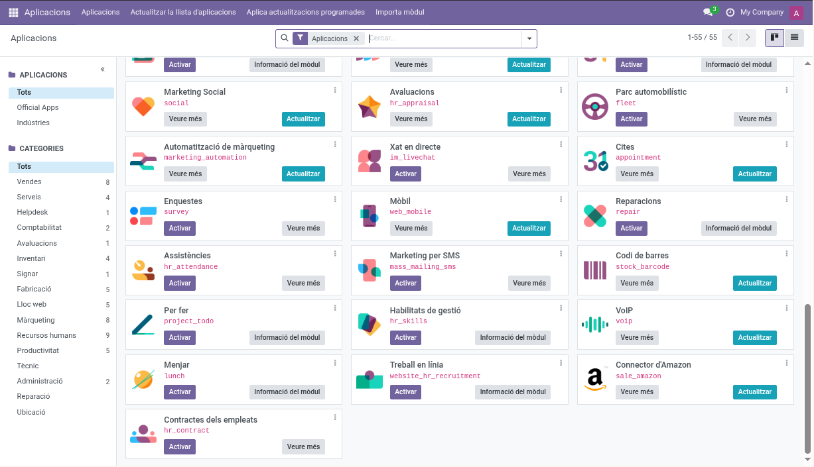

# Instalar Odoo 18.0 en Dokku

{width="100%" height="auto"}

Proceso de instalación de odoo en servidor vps con dokku.

## Bajar instalador

wget https://github.com/edumag/install_odoo_dokku/archive/refs/heads/master.zip
unzip master.zip
cd install_odoo_dokku-master

## Configurar

Copiar el archivo `.env-example` a `.env`

    cp .env-example .env

Adaptar las variables de entorno.

Subir a servidor el fichero .env y el script install_odoo_dokku.sh

    source .env
    scp .env install_odoo_dokku.sh $DOKKU_HOST:~/install_odoo_dokku/


## En servidor

Ejecutar script.

    cd ~/install_odoo_dokku
    ./install_odoo_dokku.sh

## En local

    git clone https://github.com/odoo/docker.git
    cp -r docker/18.0/* ./odoo/
    rm -fr docker

Definir puerto de la aplicación en odoo/odoo.conf:

    db_port = 5432

### Deploy

    cd odoo
    git remote add dokku dokku@${DOKKU_HOST}:${APPNAME}
    git push dokku master

## En servidor

### Instalar Let's Encrypt

```
source .env
dokku letsencrypt:set $APPNAME email $EMAIL
dokku letsencrypt:enable $APPNAME
```

## En local

### Instalar addons

#### l10n_es_aeat y l10n_es_aeat_mod303

Nos permite generar el modelo 303 que se debe enviar para la declaración del IVA trimestral.

    cd ModuleRepositories
    git clone https://github.com/OCA/l10n-spain.git

    # Rama 18.0
    cd l10n-spain ; git checkout 18.0 ; cd -
    cd l10n-spain/l10n_es_aeat ; git checkout 18.0 ; cd -
    cd l10n-spain/l10n_es_aeat_mod303 ; git checkout 18.0 ; cd -

    cp -r l10n-spain ../odoo/addons/
    cp -r l10n-spain/l10n_es_aeat_mod303 ../odoo/addons/
    cp -r l10n-spain/l10n_es_aeat ../odoo/addons/

#### account_tax_balance

    cd ModuleRepositories
    git clone https://github.com/edumag/account_tax_balance.gitgit clone https://github.com/OCA/account-financial-reporting.git
    cd account-financial-reporting
    git checkout 18.0
    cd ..
    cp -r account-financial-reporting/account_tax_balance ../odoo/addons/

#### date_range

    cd ModuleRepositories
    git clone https://github.com/OCA/server-ux.git
    cd server-ux
    git checkout 18.0
    cd ..
    cp -r server-ux/date_range ../odoo/addons/

#### Otros módulos

Se pueden bajar desde https://odoo-community.org/shop

#### Subir módulos al servidor

    scp -r addons/* ${DOKKU_HOST}:/var/lib/dokku/data/storage/$APPNAME/addons/

## En servidor

### Reiniciar aplicación

    dokku ps:restart $APPNAME

### Activar modo desarrollador

Ir a configuraciones -> Herramientas de desarrollo -> Modo desarrollador.

### Activar módulos

Ir a Aplicaciones.

En modo desarrollador tendremos la opción de actualizar la lista de módulos y podremos activarlos.

## Varios

### Eliminar aplicación en dokku

Desde el servidor:

    ./install_odoo_dokku.sh remove

### Repositorio OCA

    https://github.com/OCA

## Post instalación

Al entrar por primera vez nos pedirá que configuremos la base de datos.

### Gestionar base de datos.

Desde https://${DOMAIN}/web/database/manager podremos Crear, restaurar, hacer
un backup o cambiar contraseña maestra.


